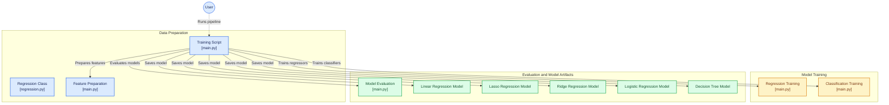

# Hotel Rate Prediction
### Machine Learning

## Hotel Rate Prediction Workflow

```mermaid id="h7k2pm"
flowchart TD
    subgraph group_prep["Data Preparation"]
        node_main["Training Script<br/>[main.py]"]
        node_regression_class["Regression Class<br/>[regression.py]"]
        node_feature_prep["Feature Preparation<br/>[main.py]"]
    end

    subgraph group_models["Model Training"]
        node_regression_training["Regression Training<br/>[main.py]"]
        node_classification_training["Classification Training<br/>[main.py]"]
    end

    subgraph group_evaluation["Evaluation and Model Artifacts"]
        node_evaluation["Model Evaluation<br/>[main.py]"]
        node_linear_model["Linear Regression Model"]
        node_lasso_model["Lasso Regression Model"]
        node_ridge_model["Ridge Regression Model"]
        node_logistic_model["Logistic Regression Model"]
        node_tree_model["Decision Tree Model"]
    end

    node_operator(("User"))

    node_operator -.->|"Runs pipeline"| node_main
    node_main -->|"Prepares features"| node_feature_prep
    node_main -->|"Trains regressors"| node_regression_training
    node_main -->|"Trains classifiers"| node_classification_training
    node_main -->|"Evaluates models"| node_evaluation
    node_main -->|"Saves model"| node_linear_model
    node_main -->|"Saves model"| node_lasso_model
    node_main -->|"Saves model"| node_ridge_model
    node_main -->|"Saves model"| node_logistic_model
    node_main -->|"Saves model"| node_tree_model

    click node_main "https://github.com/yassakamille/hotel_rate_prediction/blob/main/main.py"
    click node_regression_class "https://github.com/yassakamille/hotel_rate_prediction/blob/main/regression.py"
    click node_feature_prep "https://github.com/yassakamille/hotel_rate_prediction/blob/main/main.py"
    click node_regression_training "https://github.com/yassakamille/hotel_rate_prediction/blob/main/main.py"
    click node_classification_training "https://github.com/yassakamille/hotel_rate_prediction/blob/main/main.py"
    click node_evaluation "https://github.com/yassakamille/hotel_rate_prediction/blob/main/main.py"
    click node_linear_model "https://github.com/yassakamille/hotel_rate_prediction/blob/main/linear_regression.sav"
    click node_lasso_model "https://github.com/yassakamille/hotel_rate_prediction/blob/main/lasso_regression.sav"
    click node_ridge_model "https://github.com/yassakamille/hotel_rate_prediction/blob/main/ridge_regression.sav"
    click node_logistic_model "https://github.com/yassakamille/hotel_rate_prediction/blob/main/Logistic_Regression_classifier.sav"
    click node_tree_model "https://github.com/yassakamille/hotel_rate_prediction/blob/main/decision_tree_classifier.sav"

    classDef toneNeutral fill:#f8fafc,stroke:#334155,stroke-width:1.5px,color:#0f172a
    classDef toneBlue fill:#dbeafe,stroke:#2563eb,stroke-width:1.5px,color:#172554
    classDef toneAmber fill:#fef3c7,stroke:#d97706,stroke-width:1.5px,color:#78350f
    classDef toneMint fill:#dcfce7,stroke:#16a34a,stroke-width:1.5px,color:#14532d
    classDef toneRose fill:#ffe4e6,stroke:#e11d48,stroke-width:1.5px,color:#881337
    classDef toneIndigo fill:#e0e7ff,stroke:#4f46e5,stroke-width:1.5px,color:#312e81
    classDef toneTeal fill:#ccfbf1,stroke:#0f766e,stroke-width:1.5px,color:#134e4a

    class node_main,node_regression_class,node_feature_prep,node_operator toneBlue
    class node_regression_training,node_classification_training toneAmber
    class node_evaluation,node_linear_model,node_lasso_model,node_ridge_model,node_logistic_model,node_tree_model toneMint
```

